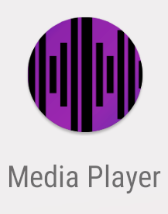
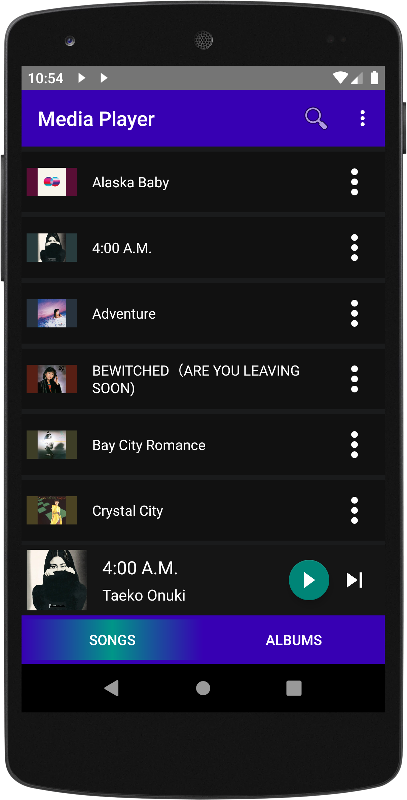
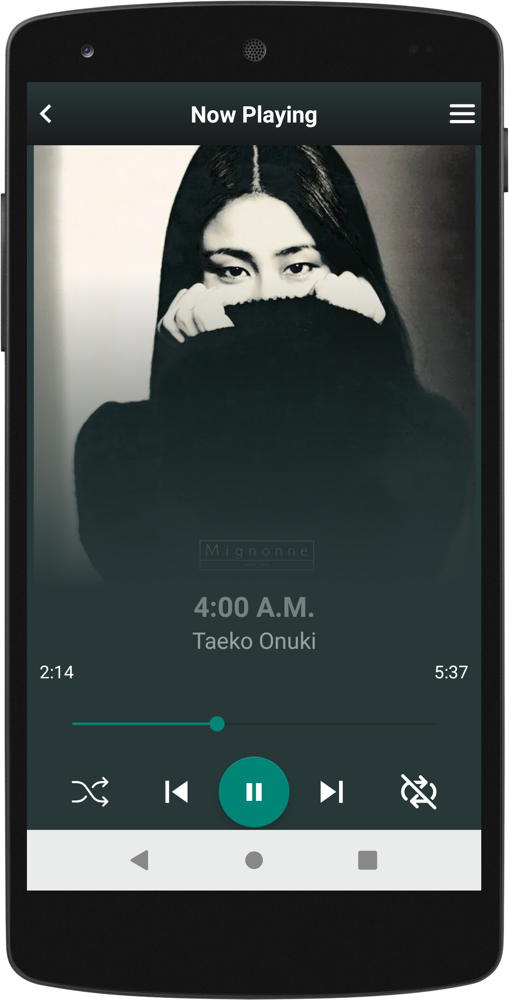
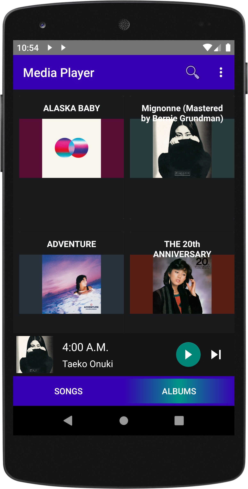
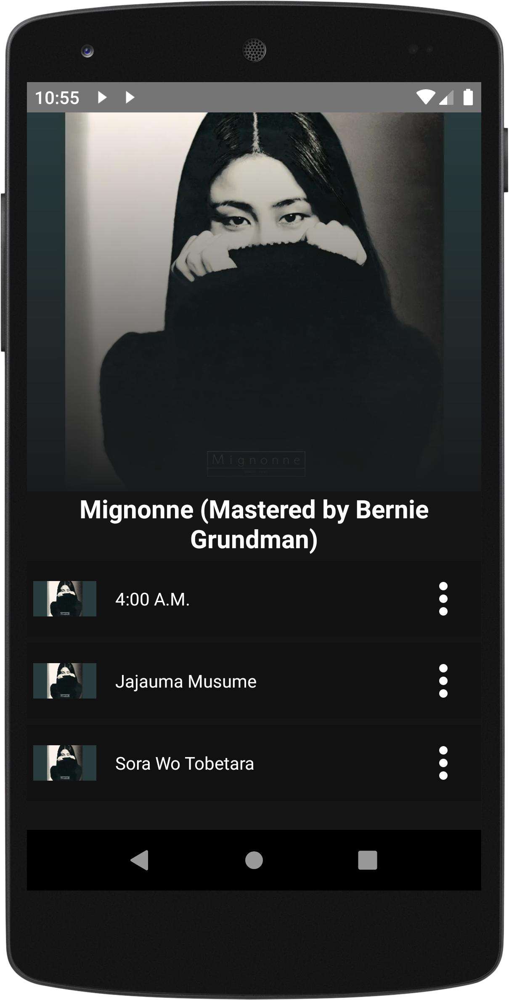
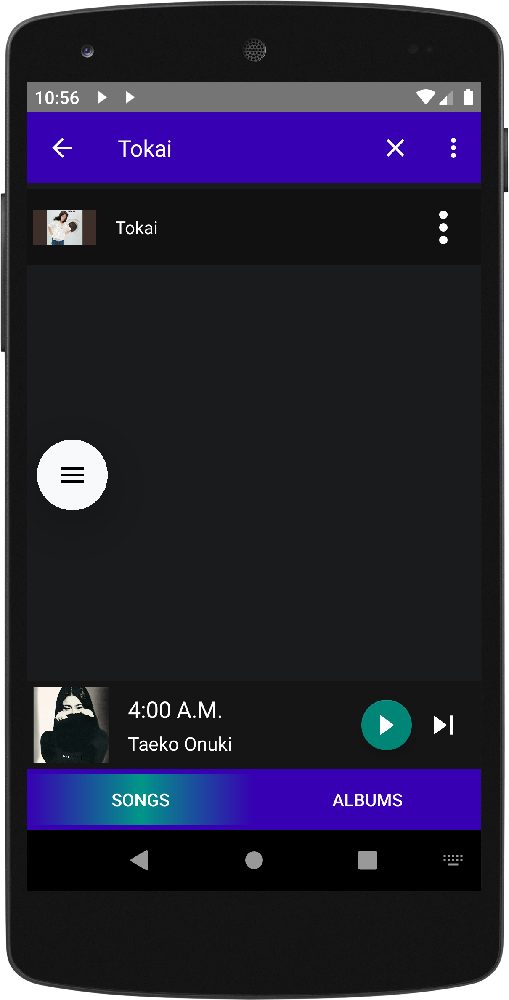
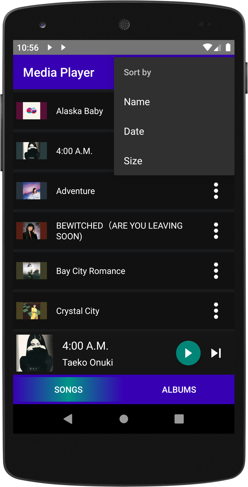
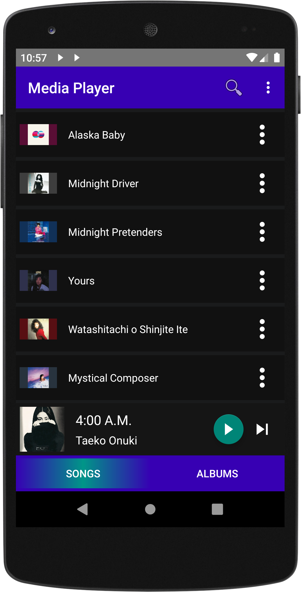

# Media Player made in Java in Android Studio

# 🎵 Java Media Player Application

A modern and intuitive Media Player application built with **Java**, designed to provide a clean and functional music playback experience. Browse albums, search and filter songs, and enjoy your favorite tracks with ease.

## ✨ Features

- 🎶 **Play MP3 files** with a simple and responsive interface  
- 📁 **Organized album view** with album covers and song lists  
- 🔍 **Real-time search and filtering** of your music collection  
- ▶️ **Playback controls**: Play, Pause, Next, Previous, Seek  
- 📱 Clean UI with multiple navigation views: Home, Album, and Player

---

## 📸 Screenshots

### 🏠 Main Screen
Shows the home interface with a list of recently played or available songs.

---

### 🎧 Media Player
Includes full playback controls and current track info.

---

### 💿 Album View
Displays all albums found in the media library.

---

### 📂 Album Detail
Shows all the songs belonging to a selected album.

---

### 🔎 Search and Filter
Search and filter songs in real-time by title, artist, or album.

*You can search every song by its name*

*You can filter by Name, Date and Size*

*Filtered by Size*

---

## 🚀 How to Run

1. Open the root in Android Studio
2. Build and run the app